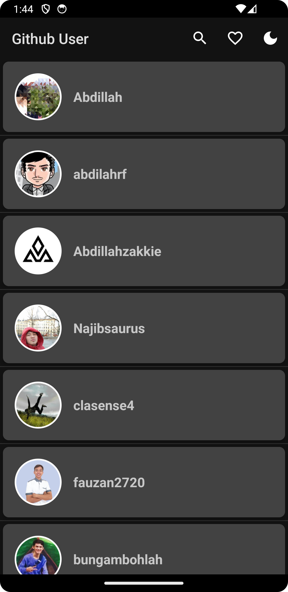

# GitHub Users Application

## Description

The GitHub Users Application is an Android app developed as the culminating project for the "Belajar Fundamental Aplikasi Android" course by Dicoding. Built with Kotlin, it enables users to explore GitHub users. Leveraging the GitHub API, it features user search functionality, the ability to add favorites for quick access, and offers a convenient dark mode option for improved readability in low-light environments.

**Note** : For learning purposes, not for plagiarism, following Dicoding's rules.

## Features
- **Explore**: Navigate through GitHub users effortlessly.
- **Search**: Easily locate specific users using the search functionality.
- **User Profiles**: Dive into detailed user profiles, showcasing followers, and following.
- **Favorites**: Bookmark preferred users for swift access.
- **Night Mode**: Switch between light and dark themes for personalized viewing comfort.

## Preview Application
### Light Mode
| Home | Search | User Details |
| --- | --- | --- |
|  |  |  |

| Favorites | Settings | 
| --- | --- |
|  |  |

### Dark Mode
| Home | Search | User Details
| --- | --- | --- |
|  |  |  |

| Favorites | Settings | 
| --- | --- |
|  |  |